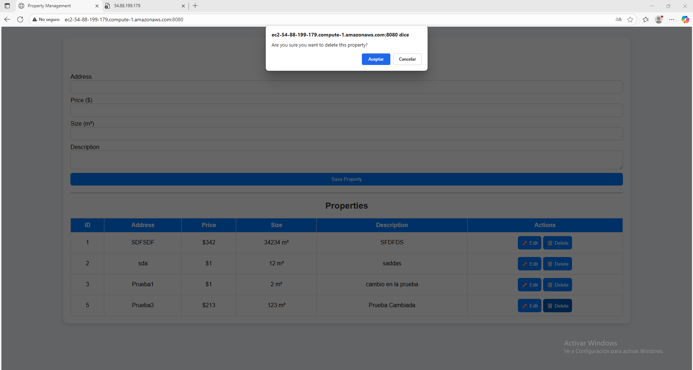

# Lab05-Arep

## Project Summary

This project is a **CRUD (Create, Read, Update, Delete) system** for managing real estate properties.  
It provides a **web application** where users can:
- Create new property listings.
- View all properties and details of a single property.
- Update property information.
- Delete property listings.

The system is composed of a **Spring Boot REST API** as the backend, a **MySQL/MariaDB database** for persistence, and a **frontend (HTML + JavaScript)** for interaction with users.  
All services are deployed on **AWS EC2 instances** (backend + frontend) and **AWS RDS** (database).  

## System Architecture


- **Frontend**:
    - Simple HTML + CSS + JavaScript interface.
    - Uses `fetch` API to call the backend services.
    - Provides forms and a table to manage properties.

- **Backend**:
    - Developed in **Spring Boot**.
    - Exposes REST endpoints for CRUD operations:
        - `POST /api/properties` → Create property
        - `GET /api/properties` → List all properties
        - `GET /api/properties/{id}` → Get property by ID
        - `PUT /api/properties/{id}` → Update property
        - `DELETE /api/properties/{id}` → Delete property

- **Database**:
    - **MariaDB/MySQL** running in AWS RDS.
    - Properties are persisted in the table `properties`.


## Class Design

Main backend components:

- **`Property` (Entity)**  
  Represents the `properties` table with fields:
    - `id` (auto-generated)
    - `address`
    - `price`
    - `size`
    - `description`
  ```
  @Entity
    public class Property {
    @Id
    @GeneratedValue(strategy = GenerationType.IDENTITY)
    private Long id;

    private String address;
    private Double price;
    private Integer size;
    private String description;

    public Property(String address, Double price, Integer size, String description) {
        this.address = address;
        this.price = price;
        this.size = size;
        this.description = description;
    }

    public Property() {

    }
  ```

- **`PropertyRepository` (JPA Repository)**  
  Provides CRUD database operations.

```
    @Repository
    public interface PropertyRepository extends JpaRepository<Property, Long> {
        List<Property> findByAddressContaining(String address);
        List<Property> findByPriceBetween(Double minPrice, Double maxPrice);
        List<Property> findBySizeBetween(Integer minSize, Integer maxSize);
    }
```

- **`PropertyService`**  
  Encapsulates business logic for managing properties.

```
    @Service
    public class PropertyService {
    
        @Autowired
        private PropertyRepository propertyRepository;
    
        public List<Property> getAllProperties() {
            return propertyRepository.findAll();
        }
    
        public Optional<Property> getPropertyById(Long id) {
            return propertyRepository.findById(id);
        }
    
        public Property createProperty(Property property) {
            return propertyRepository.save(property);
        }
    
        public Property updateProperty(Long id, Property propertyDetails) {
            Property property = propertyRepository.findById(id)
                    .orElseThrow(() -> new ResourceNotFoundException("Property not found with id: " + id));
    
            property.setAddress(propertyDetails.getAddress());
            property.setPrice(propertyDetails.getPrice());
            property.setSize(propertyDetails.getSize());
            property.setDescription(propertyDetails.getDescription());
    
            return propertyRepository.save(property);
        }
    
        public void deleteProperty(Long id) {
            Property property = propertyRepository.findById(id)
                    .orElseThrow(() -> new ResourceNotFoundException("Property not found with id: " + id));
    
            propertyRepository.delete(property);
        }
    
    }

```

- **`PropertyController` (REST Controller)**  
  Exposes the REST endpoints to the frontend.  

```
    @RestController
    @RequestMapping("/api/properties")
    @CrossOrigin(origins = "*")
    public class PropertyController {
    
        @Autowired
        private PropertyService propertyService;
    
        @GetMapping
        public List<Property> getAllProperties() {
            return propertyService.getAllProperties();
        }
    
        @GetMapping("/{id}")
        public ResponseEntity<Property> getPropertyById(@PathVariable Long id) {
            Property property = propertyService.getPropertyById(id)
                    .orElseThrow(() -> new ResourceNotFoundException("Property not found with id: " + id));
            return ResponseEntity.ok(property);
        }
    
        @PostMapping
        public Property createProperty(@Valid @RequestBody Property property) {
            return propertyService.createProperty(property);
        }
    
        @PutMapping("/{id}")
        public ResponseEntity<Property> updateProperty(@PathVariable Long id, @Valid @RequestBody Property propertyDetails) {
            Property updatedProperty = propertyService.updateProperty(id, propertyDetails);
            return ResponseEntity.ok(updatedProperty);
        }
    
        @DeleteMapping("/{id}")
        public ResponseEntity<?> deleteProperty(@PathVariable Long id) {
            propertyService.deleteProperty(id);
            return ResponseEntity.ok().build();
        }
    
    }
```


## Screenshots

The property **"Prueba3"** was added as shown in the image.


The description of the added property was updated.

  


The database was checked in **DBeaver** to verify correct functionality.


Now the test property will be deleted.

  


Finally, the database was checked to confirm that the property was successfully removed.


## Video

[Video Demostración despliegue y funcionamiento](https://pruebacorreoescuelaingeduco-my.sharepoint.com/:v:/g/personal/santiago_cordoba-d_mail_escuelaing_edu_co/EQT3XhVNbkhHkqKJcnq2GZoBdGiAnZsEuMr6Vmo1gAmdPg?e=RSk5KN&nav=eyJyZWZlcnJhbEluZm8iOnsicmVmZXJyYWxBcHAiOiJTdHJlYW1XZWJBcHAiLCJyZWZlcnJhbFZpZXciOiJTaGFyZURpYWxvZy1MaW5rIiwicmVmZXJyYWxBcHBQbGF0Zm9ybSI6IldlYiIsInJlZmVycmFsTW9kZSI6InZpZXcifX0%3D)

## Built With

* [Java](https://www.java.com/es) - Lenguaje para el backend
* [Maven](https://maven.apache.org/) - Manejo de Dependencias
* [Spring initializr](https://start.spring.io) - Crear el proyecto de Spring con dependencias
* [AWS](https://aws.amazon.com/es/free/?trk=90bc4346-f6a5-4430-b543-83e255b54666&sc_channel=ps&ef_id=CjwKCAjwobnGBhBNEiwAu2mpFGmYC_nqnz9GF7a-i-QbT3aLWvsfkpjY0XLhTyglvGtvzrK5R8fM7BoC29AQAvD_BwE:G:s&s_kwcid=AL!4422!3!647999754693!e!!g!!aws!19685286946!149715822407&gad_campaignid=19685286946&gclid=CjwKCAjwobnGBhBNEiwAu2mpFGmYC_nqnz9GF7a-i-QbT3aLWvsfkpjY0XLhTyglvGtvzrK5R8fM7BoC29AQAvD_BwE) - Plataforma de servicios de nube


## Authors

* **Santiago Córdoba Dueñas**  - [Santiago Córdoba](https://github.com/Santiago-Cordoba)

## Acknowledgments

* Aprendizaje acerca del funcionamiento de un EC2 en AWS
* Refuerzo del uso de bases de datos como persistencia en API´s
* Aprendizaje de instalacion de una base de datos en una instancia EC2
